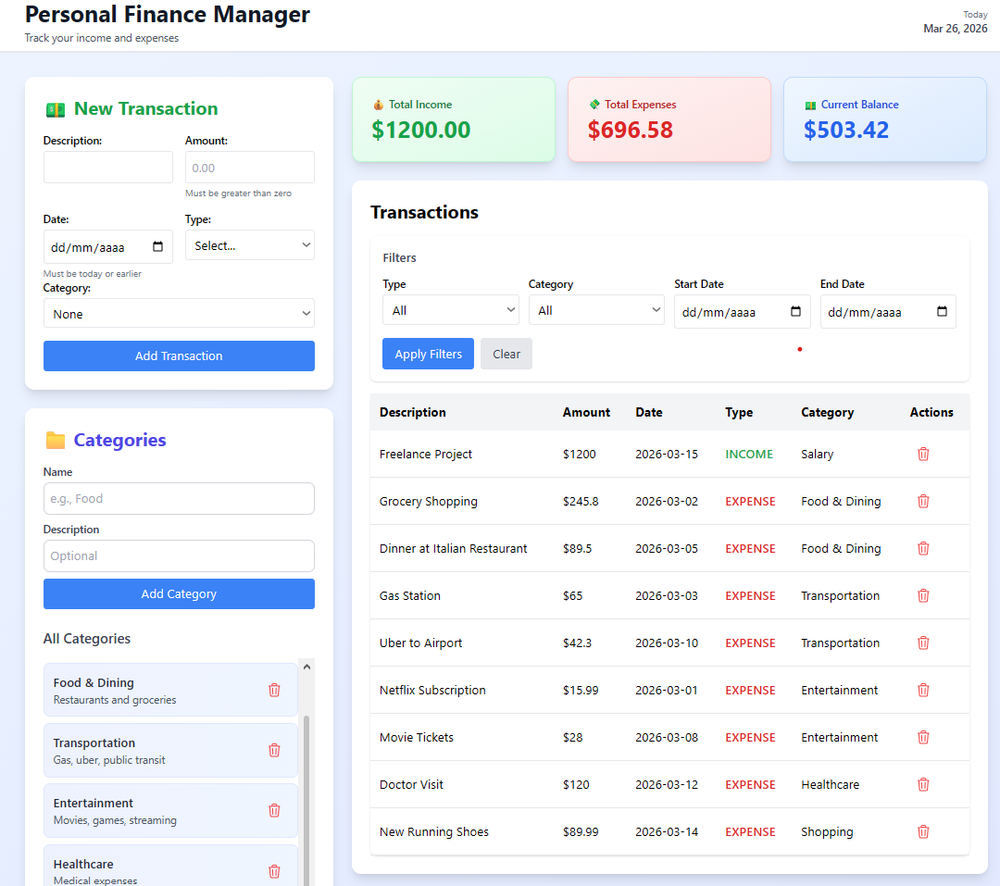

# Personal Finance Manager

A full-stack web application designed to help you take control of your personal finances. Track income and expenses, organize transactions by categories, and visualize your financial health through an intuitive dashboard.


## Dashboard Overview



_Dashboard showing balance summary, categories, and transaction history_

---

## Features

- **Transaction Management**: Create, view, and delete financial transactions
- **Balance Dashboard**: Real-time income, expenses, and balance overview
- **Category System**: Organize transactions with custom categories
- **Advanced Filters**: Filter transactions by type, date range, and category

## 🛠️ Tech Stack

### Backend

- **Java 22.0.1** - Programming language
- **Spring Boot 4.0.2** - Framework
- **Spring Data JPA** - Data persistence
- **H2 Database** - In-memory database
- **Maven** - Dependency management
- **Bean Validation** - Input validation

### Frontend

- **React 19.2.4** - UI library
- **Tailwind CSS** - Styling
- **Axios** - HTTP client
- **Heroicons** - Icon library

## Getting Started

### Prerequisites

- Java 17 or higher
- Node.js 16+ and npm
- Git

### Installation

1. **Clone the repository**

```bash
git clone https://github.com/Valentim-dg/personal-finance-manager.git
cd personal-finance-manager
```

2. **Run the Backend**

```bash
cd backend/finance-api
./mvnw spring-boot:run
```

Backend will start on `http://localhost:8080`

3. **Run the Frontend** (in a new terminal)

```bash
cd frontend/finance-app
npm install
npm start
```

Frontend will open on `http://localhost:3000`

## 📡 API Endpoints

### Transactions

- `GET /api/transactions` - List all transactions
- `GET /api/transactions/{id}` - Get transaction by ID
- `POST /api/transactions` - Create transaction
- `PUT /api/transactions/{id}` - Update transaction
- `DELETE /api/transactions/{id}` - Delete transaction
- `GET /api/transactions/balance` - Get balance summary
- `GET /api/transactions/filter` - Filter transactions

### Categories

- `GET /api/categories` - List all categories
- `GET /api/categories/{id}` - Get category by ID
- `POST /api/categories` - Create category
- `PUT /api/categories/{id}` - Update category
- `DELETE /api/categories/{id}` - Delete category
